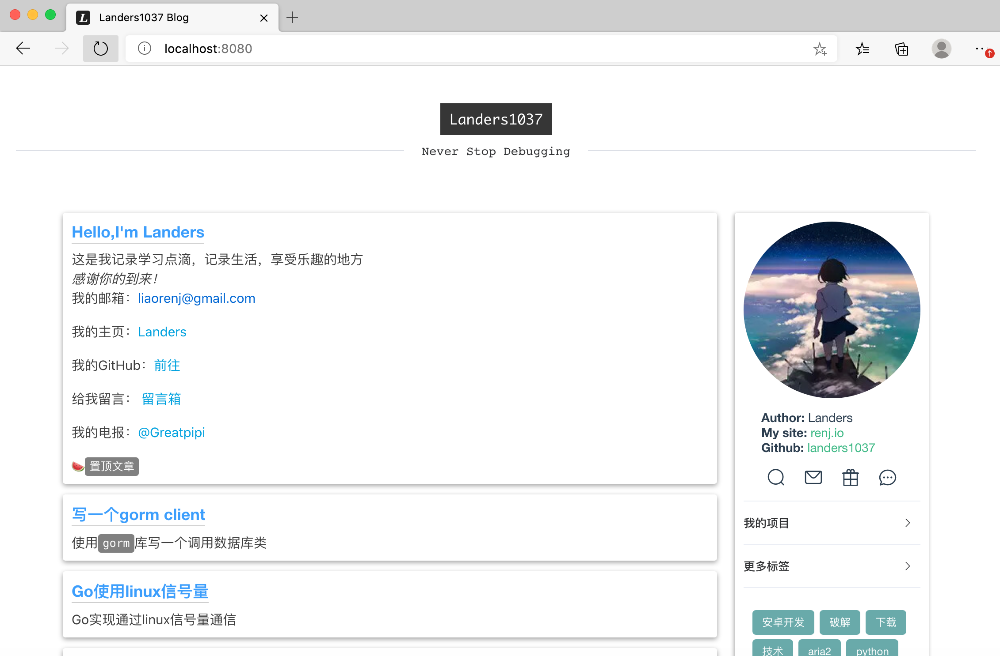
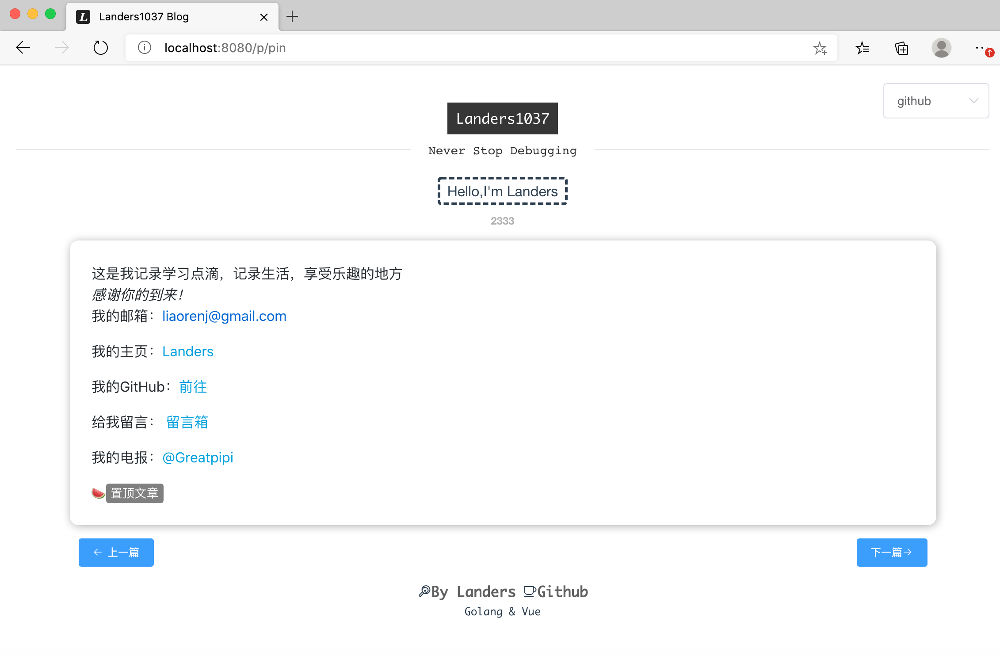
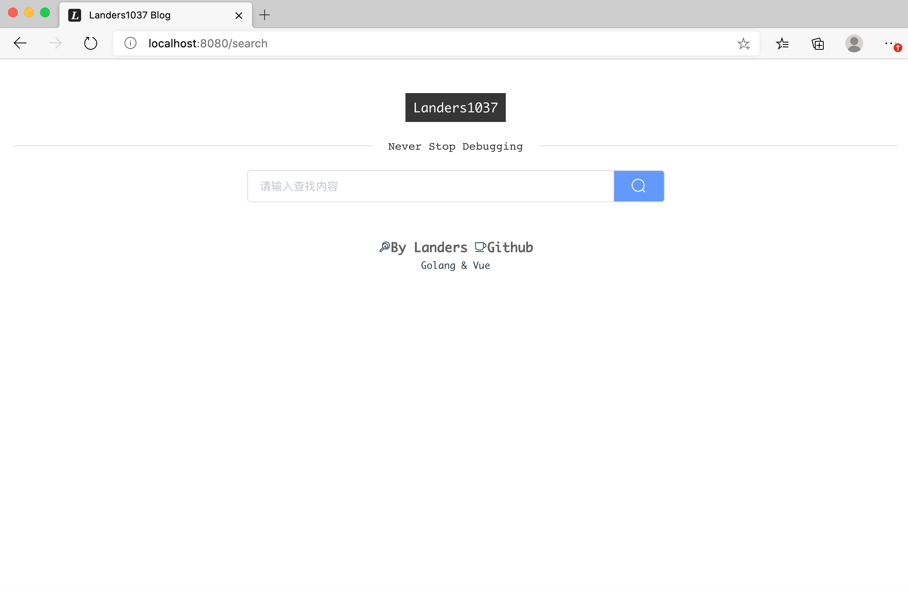
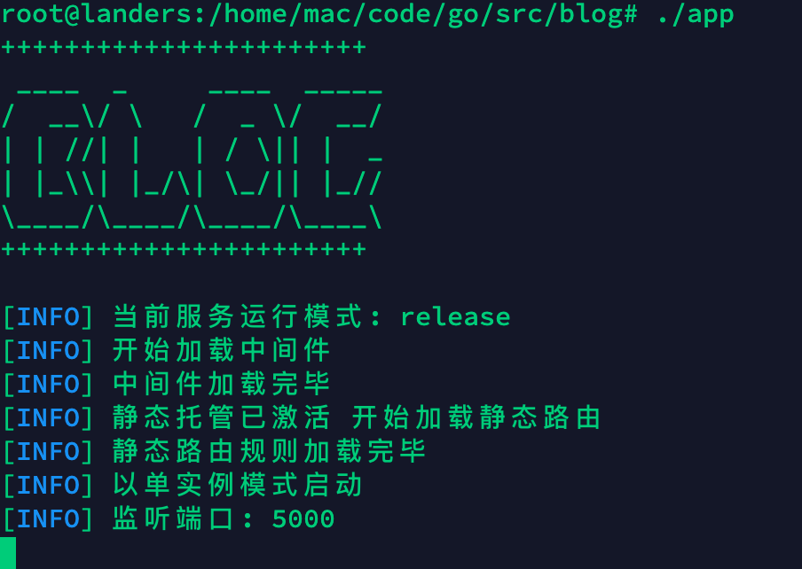

# blog

   

`blog` is a go&amp;vue blog using markdown

`blog`是一个基于go的后端markdown渲染服务，搭配vue实现的前端页面共同组成一个完整的个人博客发布服务

旨在提供markdown文本的博客部署服务

如果你在使用markdown写作 请尝试使用本服务

## 安装

```bash
go get github.com/landers1037/blogo
```

程序会安装到`$GOPATH/bin/blogo`

## 快速开始

使用docker快速开始你的个人博客之旅

[如何创建一个blog容器](quick_start.md)

## 开发记录

[records](record/record.md)

## Changelog

[更新日志](CHANGELOG.md)

## 图示










## 特性🛸

- 完整的迁移工具链 不管你是使用纯净的markdown还是hexo格式md
- markdown文本的语法高亮支持
- 高级统计功能 支持统计总访问量，文章访问量，文章分享量，文章点赞量
- 支持博客留言 文章的评论功能
- 支持多种排序准则 可以按照自己的方式选择想要的文章显示顺序
- 完善的后台管理页面，方便管理者管理数据
- 支持新文章的上传和文章的导出功能 随时备份你的博客
- 多数据库支持 关系型数据库（sqlite，mysql）
- 缓存支持 支持redis缓存 后期将更换为我的开源项目[Plnack](https://github.com/landers1037/plnack)
- 新特性.env定制环境变量
- 前端支持定制页面 定制不同区域的显示效果

本服务前端依赖nginx服务或者其他静态文件服务器，如果你只想要直接运行，请clone本库的br_ng分支

br_ng分支提供了静态文件的直接代理

## 使用🦄️

启动本服务，你可以在release页面下载本服务包，拷贝到你的服务器上或者本机运行

> 注意：win_amd64版本不支持需要linux特性，仅可作为本地调试使用

```bash
unzip blog_xxx.zip
cd blog_xxx
chmod +x blog
./blog
```

服务包内预置了程序启动需要的配置文件，你可以自定义此文件以实现不同的配置

### 命令

本服务内置了方便直接使用的命令（仅支持unix）

```bash
./app_blog -h # 查看帮助信息
NAME:
   blog - powerful markdown-based blog

USAGE:
   app_blog [global options] command [command options] [arguments...]

VERSION:
   v6.0

DESCRIPTION:
   一个基于markdown文档的动态博客部署工具

AUTHORS:
   Landers <liaorenj@gmail.com>
   wxk <xk_wang@qq.com>

COMMANDS:
   help, h  Shows a list of commands or help for one command
   App configs:
     config, conf, c  应用配置
   Run a web service:
     web, w, serve, server  启动blog的web服务
   Service manager:
     service, s  服务管理
   Tools of blog:
     tool, t  博客配套工具

GLOBAL OPTIONS:
   --help, -h     show help (default: false)
   --version, -v  print the version (default: false)

COPYRIGHT:
   renj.io 2021.
```

完整的现代化CLI工具支持

当`cluster`为`1`时 使用集群模式，此时服务将支持使用`-p`参数监听多个端口启动多个子实例线程

如：

```bash
# ./app_blog web cluster -h
NAME:
   blog web cluster - 集群模式启动服务

USAGE:
   blog web cluster [command options] [arguments...]

CATEGORY:
   Run a web service

OPTIONS:
   --port value, -p value  设置启动端口 (default: "5000")
   --conf value, -c value  设置配置文件路径 (default: "conf/app.ini")
   --help, -h              show help (default: false)
# 例如   
./blog web cluster -p "8888 9999"
# 服务将运行监听于端口8888 9999
```

#### 启动服务

```bash
./blog web start
# 此命令将启动后台服务，日志记录于配置文件中定义的路径 进程pid同
```

#### 指定端口启动

```bash
./blog web start -p 9000
```

#### 指定配置文件启动

默认的配置文件是`conf/app.ini` 通过-c参数可以指定配置文件

```bash
./blog web start -c /etc/test.ini
```

```bash
#./blog web start -h
NAME:
   blog web start - 正常模式启动服务

USAGE:
   blog web start [command options] [arguments...]

CATEGORY:
   Run a web service

OPTIONS:
   --port value, -p value  设置启动端口 (default: 5000)
   --conf value, -c value  设置配置文件路径 (default: "conf/app.ini")
   --help, -h              show help (default: false)
```

#### 停止服务

基于linux特性的pid kill方式停止

```bash
./blog service stop
```

#### 重启服务

```bash
./blog service restart
```

#### ~~重载配置文件(废弃)~~

```bash
./blog -r
```

#### 测试模式

```bash
./blog web test
# 一般用于调试时使用 测试模式下监听于5000端口
```

### 工具集合

```bash
NAME:
   blog tool - 博客配套工具

USAGE:
   blog tool command [command options] [arguments...]

COMMANDS:
   help, h  Shows a list of commands or help for one command
   Tools of blog:
     db       初始化数据库
     conf     初始化配置
     new      新建文档
     temp     修改模板
     migrate  迁移链接[旧] [新]

OPTIONS:
   --help, -h  show help (default: false)
```


#### 新建文档

```bash
./app_log tool new 文档名
```

#### 生成配置

```bash
./app_blog tool conf
```

#### 修改文档模板

模板默认会保存在`/etc/blog.meta`中

```bash
./app_blog tool temp

# 默认的模板
---
title: %s
name: %s
date: %s
tags: []
categories: []
abstract:
---
<!--more-->
```

#### 迁移链接

通用的字符串替换工具 可以用于替换图床的地址

```bash
./app_blog tool migrate old new
```


## 配置文件🔨

本服务的配置文件路径为`conf/app.ini`

如下：

```ini
# config for app
# mode can be debug/release
[mode]
RUN_MODE = debug

[run]
APP_NAME = blog
APP_PID = blog.pid
APP_LOG = blog.log
APP_LOG_LEVEL = error
APP_LOG_FILE = app.log
APP_LOG_ENABLE = 1

[app]
PAGE_SIZE = 8
MESSAGE_SIZE = 5
SORT_POST_BY = id
SORT_POST_REVERSE = 1
SORT_MESSAGE_BY = id
SORT_MESSAGE_REVERSE = 1
SORT_COMMENT_BY = id
SORT_COMMENT_REVERSE = 1
USE_CONTENT_AS_ABS = 1
MAX_CONTENT_LENGTH = 120
CUSTOM_EMPTY_ABS = <code>Sorry</code>该文章暂无概述
FAKE_STATIC_URL = 0
ZHUANLAN_ID = 1
JWT_SECRET = 10086call
APP_REFER = blog.renj.io
APP_HOST = 127.0.0.1
APP_DOMAIN = blog.renj.io
APP_ALLOW_IE = 0

[server]
HTTP_PORT = 5000
READ_TIMEOUT = 60
WRITE_TIMEOUT = 60
CLUSTER = 1
STATIC_ROUTER = 0
HIDE_DB_LOG = 1

[admin]
USERNAME = admin
PASSWD = 12345
COOKIE_MAX_AGE = 3600

[mysql]
TYPE = mysql
USER = root
PASSWORD = 123456
HOST = 127.0.0.1:3306
NAME= blog
TABLE_PREFIX = blog_

# where db is
[sqlite]
DB = blog.db

# if use middleware set 1
[middle]
UV = 1
POSTVIEW = 1
SIMPLEAUTH = 0
USEREDIS = 0
CORS = 1
TRY_FILE = 0
TRY_FILE_INDEX = dist/index.html

[redis]
Host = 127.0.0.1:6379
Password =
MaxIdle = 30
MaxActive = 30
IdleTimeout = 200
EXPIRES = 60
POSTSTIMEOUT = 10
```

### 配置说明🚀

#### mode

运行的模式 参数可选debug，release。测试模式，发布模式

#### run

运行时配置，主要配置程序运行时的日志路径和pid路径

搭配`-s start`命令使用

`APP_NAME` 程序名称 帮助操作系统找寻此服务程序二进制文件

`APP_LOG` 程序的运行日志路径 支持绝对和相对路径（start命令需要的）

`APP_PID` 程序的pid路径 支持绝对和相对路径

`APP_LOG_LEVEL` 日志记录级别 可选error info

`APP_LOG_FILE` 基于文件的日志路径

`APP_LOG_ENABLE`  是否开启文件日志 默认关闭输出到终端

#### app

博客服务相关的配置

`PAGE_SIZE` 懒加载使用 用于配置每次响应的博客文章数目 默认8

`MESSAGE_SIZE` 懒加载使用 用于配置每次响应的留言数目 默认5

`SORT_POST_BY` 配置按照何种规则排序你的博客文章 支持(id, name, date, update, title)即主键，文章url，文章创建时间，文章更新时间，文件标题， 默认id

`SORT_POST_REVERSE` 配置是否反序排列

`SORT_MESSAGE_BY` 配置按照何种规则排序留言 支持(id, user, date)即主键， 留言用户，留言时间 默认id

`SORT_MESSAGE_REVERSE` 配置是否反序排列

`SORT_COMMENT_BY`   配置按照何种规则排序评论 支持(id, user, date, comment)即主键 留言用户，留言时间，留言内容 默认id

`SORT_COMMENT_REVERSE` 配置是否反序排列

`USE_CONTENT_AS_ABS` 配置是否使用文章正文代替摘要（仅在摘要为空时生效）

`MAX_CONTENT_LENGTH` 配置使用文章正文代替摘要时应该截取的长度

`CUSTOM_EMPTY_ABS` 配置当摘要为空时，应该显示的默认摘要内容（使用文章内容代替摘要开启时 此配置无效）

`FAKE_STATIC_URL` 配置是否启用伪静态地址 开启后所有的博客文章地址变为xxx.html的伪静态链接

`ZHUANLAN_ID` 专栏生成的url使用数字id还是使用英文url（当英文url不存在时自动使用id）

`JWT_SECRET` json web token使用的密钥

`APP_REFER` 防止滥用时开启 允许通过的请求头refer 多个时使用空格分开

`APP_HOST` 防止滥用时开启 允许通过的请求头host 多个时使用空格分开

`APP_DOMAIN` 用于生成cookie时确定cookie域名，在这里配置你的博客域名

`ALLOW_IE` 是否允许旧版IE浏览器访问本服务 0禁止 1允许

#### server

服务器相关配置

`HTTP_PORT` 服务运行的端口

`READ_TIMEOUT`  最大读取超时时间

`WRITE_TIMEOUT` 最大写入超时时间

`CLUSTER` 是否开启集群模式 0关闭 1开启

`STATIC_ROUTER` 是否使用blog代理前端的静态文件 在本机测试时可以使用 部署时建议使用nginx托管静态文件（开启后在conf/router.json文件中添加需要托管的文件路由）

`HIDE_DB_LOG` 每次启动时是否输出数据库初始化日志 默认输出

#### admin

后台控制页面相关配置

`ADMIN` 管理员用户名

`PASSWD` 管理员密码

`COOKIE_MAX_AGE` 用户认证的cookie超时时间 默认1800s

#### mysql

mysql数据库定制配置

#### sqlite

sqlite数据库配置

`DB` 服务的sqlite数据库位置

#### middle

中间件相关配置

`UV` 是否开启全局访问量统计 0关闭 1开启

`POST_VIEW` 是否开启文章的访问量统计 0关闭 1开启

`SIMPLE_AUTH` 是否开启简单请求过滤，用于防止接口滥用 仅允许指定refer和host请求通过

`CORS` 是否开启跨域请求 注意关闭时来自不同域的请求会被拦截

`USEREDIS` 是否启用redis前置缓存 需要配置redis

`TRY_FILE` 在不使用nginx直接由本服务代理前端页面时生效类似nginx的`try_file`指令

`TRY_FILE_INDEX` 重定向的前端主页文件

> 注意⚠️：由于try机制目前不够完善，只能自动获取所有非/api的请求重定向到前端页面，静态资源路径如：js / css并未注册在blog中会导致无法正常使用所以需要搭配`router.json`使用
>
> 你只需要简单的配置静态资源路径 并且开启`STATIC_ROUTER`即可
>
> ```json
>   [{
>     "path": "/css",
>     "type": "dir",
>     "alias": "dist/css"
>   }]
> ```
>
> 

#### redis

redis相关配置

`Host` redis的地址
`Password` redis的密码为空时 不需要填写
`MaxIdle` = redis最大空闲
`MaxActive` = redis连接池最大连接数
`IdleTimeout` = redis最大空闲超时时间
`EXPIRES` = redis内部键值对过期时间 单位s
`POSTSTIMEOUT` = 最大请求超时时间

## 默认配置文件

首次启动时如果不存在配置文件 会自动生成配置文件路径为`conf/app.ini`

这在docker容器中使用时，其绝对路径为`/app/conf/app.ini` 因为默认的运行程序位于`/app`

## 如何托管静态文件🌴

本服务支持直接托管前端的静态文件，让你无需使用nginx的反向代理机制

此功能应该仅作为本机测试使用而非正式的发布版本

**conf/router.json**

定义这个数组文件 在内部定义并实现你的路由

```json
[
  {
    "path": "/",
    "type": "file",
    "alias": "dist/index.html"
  },
  {
    "path": "/about",
    "type": "try",
    "alias": "dist/index.html"
  },
  {
    "path": "/img",
    "type": "dir",
    "alias": "dist/img"
  }
]    
```

路由配置分为三个参数`path`, `type`, `alias` 

`path` 路由的绝对路径

`type` 路由类型 file即单文件托管，dir即托管一个文件夹 实现同nginx的alias，try即需要将请求重定向到主页的路由

try参数解释：

实现类似nginx的`try_files`参数，在请求的路由实际不存在于后端时将路由交给前端的html页面处理。例如vue-router这种前端路由状体组件，本服务的对于此功能的实现并不足够智能，需要你指定需要返回前端处理的路由

当`middle`中的`TRY_FILE`开启时 同时也支持本json文件中定义的路由

`alias` 文件在服务器上的真实路径 支持绝对和相对路径，相对路径以本二进制程序所在路径为`.`

示例：type为dir时 假设path配置为`/img` 此时访问`/img/test.png`实际请求文件为`dist/img/test.png`

## 定制前端页面🌍

博客服务的前端配置指导文档

博客前端服务由vue技术栈编写 支持界面的定制化

### 使用方式

需要定义请clone本项目的front分支 进行修改编译

```bash
git clone https://github.com/Landers1037/blog.git -b br_front
```

### 定制属于自己的服务

### 定制页面

**custom.js**

```javascript
// 可自由定制的项目
// 在打包的时候使用
const customData = {
    api_url: "http://127.0.0.1:5000",
    author: "Landers",
    top_banner: "Landers1037",
    top_span: "Never Stop Debugging",
    site_name: "renj.io",
    site_url: "http://renj.io",
    http_prefix: prefix,
    site_domain: "blog.renj.io",
    github: "landers1037",
    project: "mgek.cc",
    project_des: "Mgek项目记录生活中的灵感",
    project_url: "http://mgek.cc",
    bottom_tag: "By Landers",
    bottom_url: "http://renj.io",
    bottom_tag2 : "Github",
    bottom_url2: "https://landers1037.github.io",
    bottom_span: "Golang & Vue",
    email: "mail@renj.io",
    start_year: "2017",
    start_date: "2017/7/1",
    dashboard_count: 5,
    message_duration: 1500,
    loading_duration: 1000
}
```

### 参数解析⚙️

`api_url` 需要请求的后端接口地址 正式发布时例如`https://api.xxx.com`

`author` 作者名称 显示在页面右侧栏的作者名 写上你的昵称

`top_banner` 顶部一级标题

`top_span` 顶部的自定义标语

`site_name` 右边栏可以自定义的你的网站名称

`site_url` 右边栏可以自定义的你的网站地址 点击后可以跳转

`http_prefix` 判断当前页面为http还是https

`site_domain` 用于生成文章uri时使用的自定义域名

`github` 你的githb名称 只需要你的账户名称

`project` 右边栏可以定制的你的项目名称

`project_url` 右边栏可以定制的你的项目url 可以填你的github **不填写则不会跳转**

`project_des` 右边栏关于你的项目的描述

`bottom_tag`底部标签 左标签名称

`bottom_url` 底部标签 左标签的url为空时则忽略 否则可以点击跳转

`bottom_tag2` 底部标签 右标签的名称

`bottom_url2` 底部标签 右标签的url为空时则忽略 否则可以点击跳转

`bottom_span` 底部子标签 自定义内部语句支持emoji **为空时则不显示**

`email` 你的电子邮箱

`start_year`  显示在状态弹框中的开始年份 请在这里填上开始写博客的年份

`start_date` 用于计算具体的距离开始写博客的时间 请填写如下格式`YYYY/mm/dd`

`dashboard_count` 设置点击头像后经过多少次计数才会进入后台控制页面，因为本博客不提供显式的直接登陆页面，所以在经过正确点击次数后才会显示管理员的登陆页面

新增

`message_duration` 用于控制全局的messagebox显示隐藏时间 单位ms

`loading_duration` 用于控制全局的加载背景等待时间 单位ms

### 定制样式👗

**custom.css**

在此文件中定制你的样式 注意这里定义的样式时全局生效的

```css
// 博客文章以及摘要中出现的code代码块高亮颜色
.markdown-body p code{
    background-color: #808080;
    color: #ffffff;
}

// 主页的博客标题颜色
.post .post-a{
    color: #409eff;
}

// 主页的博客标题在鼠标放置时变化的颜色
.post .post-a:hover{
    color: #2f343f;
}

// 主页的博客摘要中摘要文字的颜色
.post .abstract{
    color: #3f3f3f;
}

// 右边栏中的标签主题颜色
.el-tag--dark.el-tag--success{
    background-color: #6aaaaa;
    border-color: #6aaaaa;
}
```

值得注意的是：

在此文件中默认预置的主题外 你还可以通过f12查看页面源码自由定制页面

在此文件中写的所有css都会覆盖之前的样式

### 定制网页head

**.env**

```bash
VUE_APP_TITLE = "Landers 1037"
VUE_APP_DES = "Landers的博客，由Vue，Gin编写，版权所有归属Renj.io Landers"
VUE_APP_ID = "app_blog"
VUE_APP_AUTHOR = "Landers of renj.io"
VUE_APP_MOBILE_TITLE = "Blog"
```

定义前端的环境变量文件可以在编译完成后自动根据定义的变量生成head部分

```html
<title><%= VUE_APP_TITLE %></title>
```


## 迁移🚛

怎么从markdown文件迁移到本服务？

本服务提供一些简单易用的迁移工具 让你一键从md转移，如果你使用的是hexo生成的md文件

那么恭喜你的md文件规范和本服务相似

### md文件规范📃

```markdown
---
title: 文章标题
name: 文件名
date: 2021-02-27 01:09:52
id: 文章的id
tags: 标签
categories: 分类
abstract: 暂时无用
---
摘要
<!--more-->

正文
---
这是分割线
---
```

md文件头部使用和hexo类似的`yaml`标签信息

注意：暂不支持换行 一行为一个meta信息

`title` 文章要显示在主页的标题

`name` 文章的唯一名称 用于生成跳转url 为避免中文url的转义请使用英文

`id` 自动生成 文章的顺序 显示文章的时候使用

`tags` 数组形式[tag1, tag2, tag3]

`categories` 数组形式[cate1, cate2, cate3]

`abstract` 暂时无用 摘要 因为摘要从下面的内容中读取

#### 摘要获取

在文章中定义的`<!--more-->` more前面的内容就是摘要信息

摘要也可以为markdown文本 支持语法高亮

不存在或者为空时 则默认没有摘要


#### 正文内容

正文 = 摘要 + 正文内容

所以说摘要也是文章的一部分

#### 迁移工具

当前支持全量和增量迁移的工具`jjtool`

支持全量迁移的工具python脚本`migrate_blog.py`

### 迁移图床基础地址

blog提供命令行工具帮助完成文件中的图片链接迁移工作

```bash
blog -m old_link new_link
```

使用`-m`参数指定迁移，填入旧的链接地址和新的链接地址即可完成迁移

## 使用docker镜像

你可以自行构造镜像或者是使用dockerhub上的镜像

```bash
docker pull landers1037/blog:v5.4

docker run -d -p 5000:5000 -v /home/conf:/app/conf -v /home/data:/app/data landers1037/blog:v5.4
```

blog需要挂载两个路径conf和data

conf目录用于编写用户自定义的配置文件

data用于存放运行时的数据库和日志数据，你可以随时备份此数据

默认html静态文件会打包在容器内部的`/app/html`路径，如果你想自行编译前端文件请挂载此路径

```bash
-v /home/html:/app/html
```

在不挂载conf目录时blog不会主动生成配置文件会导致无法运行，请预先定义好app.ini配置文件

`app.ini`

```ini
# config for app
# mode can be debug/release
[mode]
RUN_MODE = release

[run]
APP_NAME = blog
APP_PID = /app/data/blog.pid
APP_LOG = /app/data/blog.log
APP_LOG_LEVEL = error
APP_LOG_FILE = /app/data/app.log
APP_LOG_ENABLE = 1

[app]
PAGE_SIZE = 8
MESSAGE_SIZE = 5
SORT_POST_BY = id
SORT_POST_REVERSE = 1
SORT_MESSAGE_BY = id
SORT_MESSAGE_REVERSE = 1
SORT_COMMENT_BY = id
SORT_COMMENT_REVERSE = 1
USE_CONTENT_AS_ABS = 1
MAX_CONTENT_LENGTH = 120
CUSTOM_EMPTY_ABS = <code>Sorry</code>该文章暂无概述
FAKE_STATIC_URL = 0
ZHUANLAN_ID = 1
JWT_SECRET = 10086call
APP_REFER = blog.renj.io
APP_HOST = 127.0.0.1 blog.renj.io
APP_DOMAIN = blog.renj.io
APP_ALLOW_IE = 0

[server]
HTTP_PORT = 5000
READ_TIMEOUT = 60
WRITE_TIMEOUT = 60
CLUSTER = 1
STATIC_ROUTER = 1

[admin]
USERNAME = admin
PASSWD = 12345
COOKIE_MAX_AGE = 3600
STOP_ADMIN = 0

[mysql]
TYPE = mysql
USER = root
PASSWORD = 123456
HOST = 127.0.0.1:3306
NAME= blog
TABLE_PREFIX = blog_

# where db is
[sqlite]
DB = /app/data/blog.db

# if use middleware set 1
[middle]
UV = 0
POSTVIEW = 0
SIMPLEAUTH = 0
USEREDIS = 0
CORS = 1
TRY_FILE = 1
TRY_FILE_INDEX = /app/html/index.html

[redis]
Host = 127.0.0.1:6379
Password =
MaxIdle = 30
MaxActive = 30
IdleTimeout = 200
EXPIRES = 60
POSTSTIMEOUT = 10
```

为了保护你的数据`/app/data`路径最好选择非容器内部存储空间

**默认的配置文件会放置在/app/example目录下**

### 使用不同命令启动容器

默认的重启方式是指定端口的前台运行，使用docker的`-d`参数以保持后台运行

你可以使用blog支持的命令行参数

## Bench mark

压力测试

#### wrk基准测试

| 模式   | 接口       | 并发连接数 | 结果     | 压力值         |
| ------ | ---------- | ---------- | -------- | -------------- |
| 平均   | /api/test/ | 8.98k/s    | 21.38ms  | 1线程 100并发  |
| 最大   | /api/test/ | 15.39k/s   | 263.18ms | 1线程 100并发  |
| 标准差 | /api/test/ | 6.14k/s    | 29.16ms  | 1线程 100并发  |
| 平均   | /api/test/ | 6.07k/s    | 56.40ms  | 2线程 1000并发 |
| 最大   | /api/test/ | 8.33k/s    | 737.51ms | 2线程 1000并发 |
| 标准差 | /api/test/ | 1.33k/s    | 71.62ms  | 2线程 1000并发 |

```bash
Running 10s test @ http://127.0.0.1:5000/hello
  1 threads and 100 connections
  Thread Stats   Avg      Stdev     Max   +/- Stdev
    Latency    53.38ms   54.25ms 496.91ms   85.81%
    Req/Sec     2.31k     2.59k   13.93k    93.00%
  22963 requests in 10.01s, 10.75MB read
Requests/sec:   2295.02
Transfer/sec:      1.07MB
```

#### webbench基准测试

| 客户端数 | 测试时长(s) | 速度             | 响应结果 （成功/失败） |
| -------- | ----------- | ---------------- | ---------------------- |
| 100      | 10          | 88530 pages/min  | 14755/0                |
| 200      | 10          | 104454 pages/min | 17409/0                |
| 300      | 10          | 91830 pages/min  | 15305/0                |
| 100      | 20          | 89790 pages/min  | 29930/0                |
| 500      | 20          | 88587 pages/min  | 29529/0                |
| 200      | 50          | 46214 pages/min  | 38512/0                |

```bash
Webbench - Simple Web Benchmark 1.5
Copyright (c) Radim Kolar 1997-2004, GPL Open Source Software.

Request:
GET /hello HTTP/1.0
User-Agent: WebBench 1.5
Host: 127.0.0.1


Runing info: 100 clients, running 10 sec.

Speed=88530 pages/min, 724470 bytes/sec.
Requests: 14755 susceed, 0 failed.
```

## 编译

本项目现已使用go mod方式管理

### 使用传统的构建方式build_blog.sh

如果你的代理有问题 你可以

```bash
export GOPROXY=https://goproxy.io,direct
```

```bash
root@ubuntu:/home/code/go/src/blog# bash build_blog.sh 
GOPATH: /home/code/go
GOPROXY: https://goproxy.io,direct
CGO_ENABLED: 1
GO111MODULE: on
start to build app
done
```

### 通过make编译

```bash
make build
```


## dependency

本项目依赖

- gin
- godotenv
- go-ini
- gorm
- vue