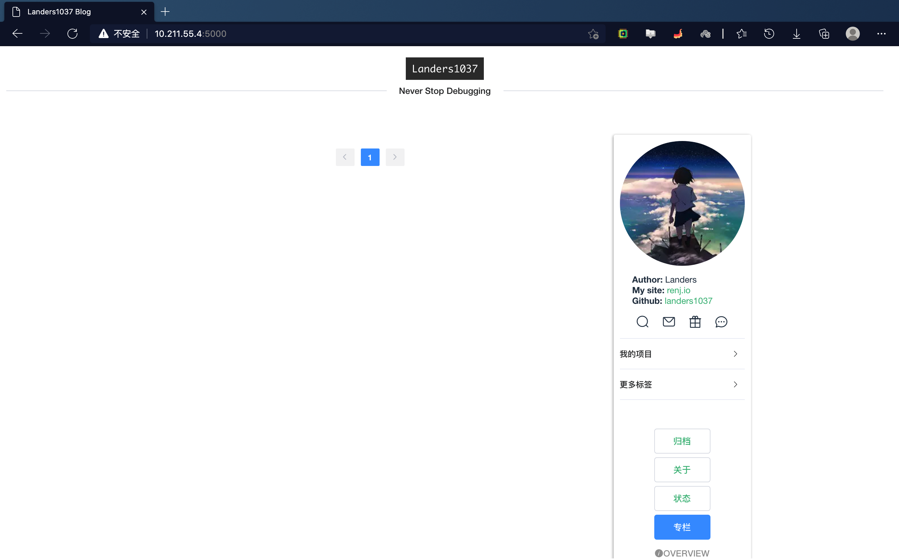
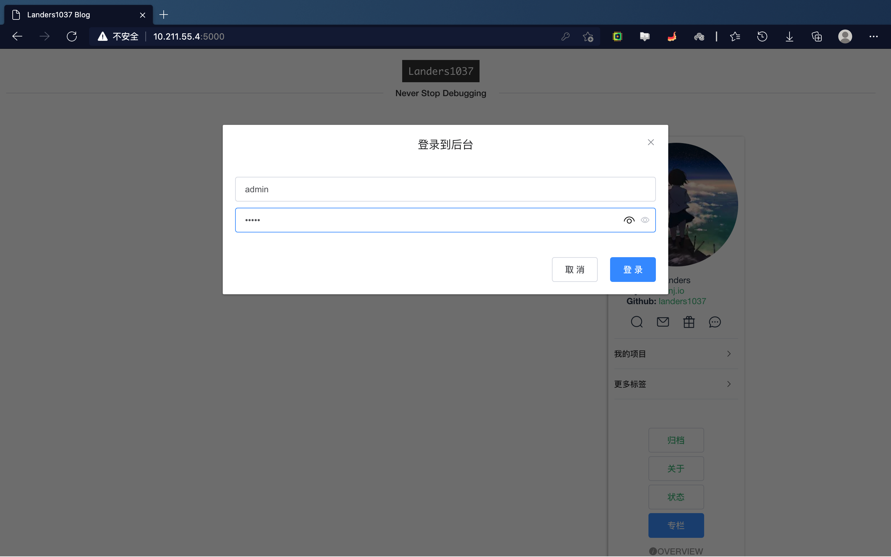
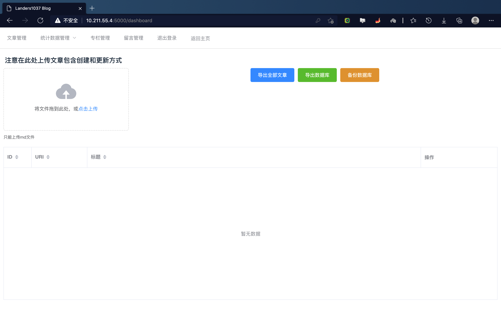
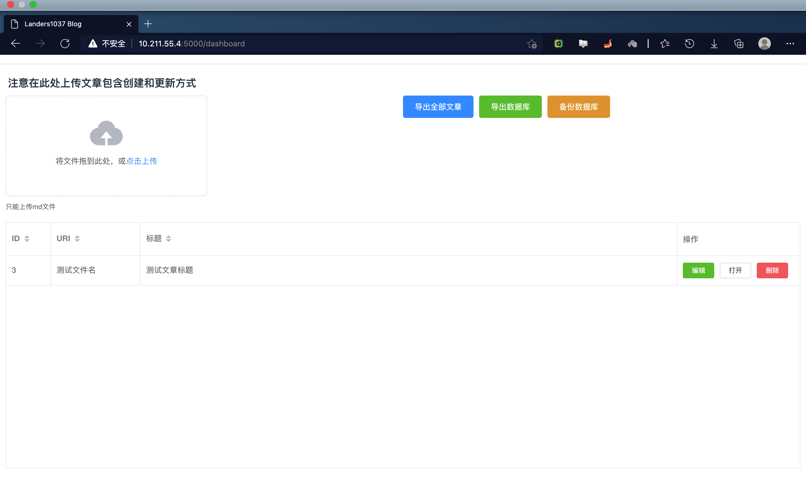
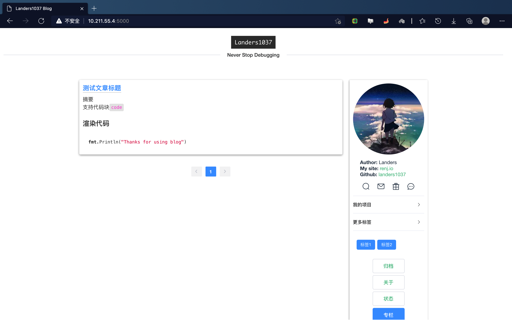
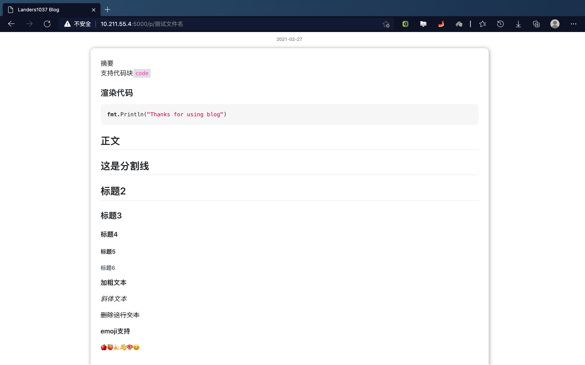
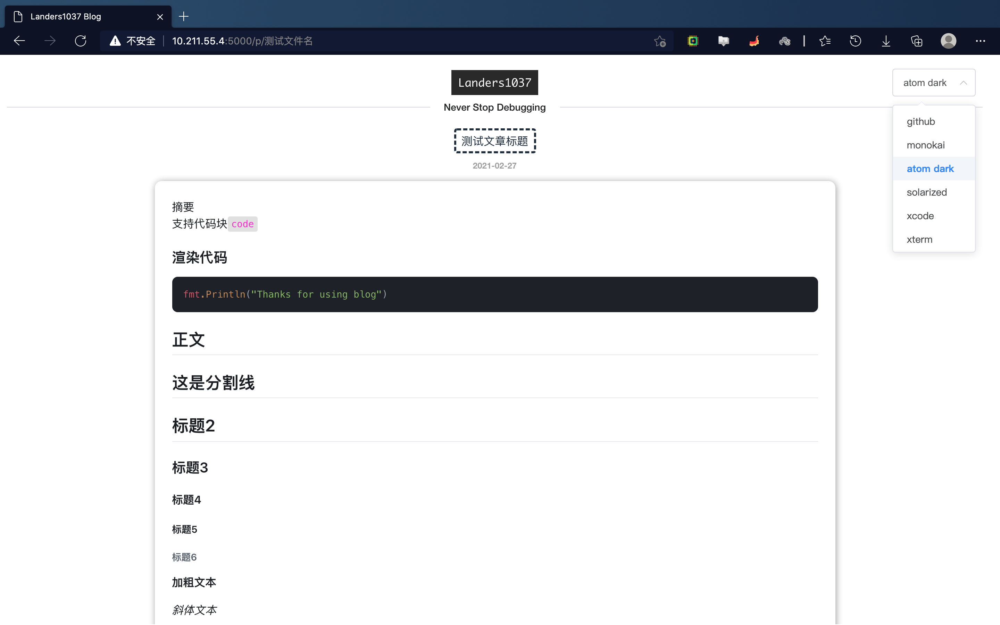

# 快速开始

## 使用docker进行容器部署

### 创建外部路径

直接在home目录下创建所需的路径`conf data html`

- conf 用于保存配置文件
- data 用于存储运行中保存的文件，如数据库
- html 前端的资源文件（不挂载时默认使用容器内`/app/html`的资源）

```bash
docker pull landers1037/blog:v5.4
docker run -d -p 5000:5000 -v /home/conf:/app/conf -v /home/data:/app/data landers1037/blog:v5.4
```

因为配置还没自动生成配置的能力所以配置文件**需要提前创建**在`/home/conf/app.ini`中

**注意： 在v5版本的镜像中已经支持自动创建默认配置文件 你只需要挂载/home/conf目录**

默认的运行时数据存储位置为`/app/data`，所以你需要挂载一个本地路径到容器路径`/app/data`来保证数据是持久化在你的本机而不是容器内部

## app运行程序的容器路径为/app

配置文件的示例如下：

```ini
# config for app
# mode can be debug/release
[mode]
RUN_MODE = release

[run]
APP_NAME = blog
APP_PID = data/blog.pid
APP_LOG = data/blog.log
APP_LOG_LEVEL = error
APP_LOG_FILE = data/blog.log
APP_LOG_ENABLE = 1

[app]
PAGE_SIZE = 8
MESSAGE_SIZE = 5
SORT_POST_BY = id
SORT_POST_REVERSE = 1
SORT_MESSAGE_BY = id
SORT_MESSAGE_REVERSE = 1
SORT_COMMENT_BY = id
SORT_COMMENT_REVERSE = 1
USE_CONTENT_AS_ABS = 1
MAX_CONTENT_LENGTH = 120
CUSTOM_EMPTY_ABS = <code>Sorry</code>该文章暂无概述
FAKE_STATIC_URL = 0
ZHUANLAN_ID = 1
JWT_SECRET = 12345
APP_REFER = blog.renj.io
APP_HOST = 127.0.0.1
APP_DOMAIN = 
APP_ALLOW_IE = 0

[server]
HTTP_PORT = 5000
READ_TIMEOUT = 60
WRITE_TIMEOUT = 60
CLUSTER = 0
STATIC_ROUTER = 1
HIDE_DB_LOG = 1

[admin]
USERNAME = admin
PASSWD = 12345
COOKIE_MAX_AGE = 3600
STOP_ADMIN = 0

[mysql]
TYPE = mysql
USER = root
PASSWORD = 123456
HOST = 127.0.0.1:3306
NAME= blog
TABLE_PREFIX = blog_

# where db is
[sqlite]
DB = data/blog.db

# if use middleware set 1
[middle]
UV = 0
POSTVIEW = 0
SIMPLEAUTH = 0
USEREDIS = 0
CORS = 1
TRY_FILE = 1
TRY_FILE_INDEX = html/index.html

[redis]
Host = 127.0.0.1:6379
Password =
MaxIdle = 30
MaxActive = 30
IdleTimeout = 200
EXPIRES = 60
POSTSTIMEOUT = 10
```

默认会关闭redis缓存和所有的统计量计算

`SIMPLEAUTH`为0表示关闭基于refer和host的访问请求限制允许任何外部访问


**docker镜像中默认生成的配置文件TRY_FILE=0即不开启静态路由 在没有额外前端代理的情况下将此值设置为1**

并在`conf`目录下添加`router.json`即可直接代理前端静态资源

**router.json**

此文件的作用为指定前端文件的web路径

当你使用web服务器如nginx部署前端服务时不需要此配置文件

默认配置

```json
[
  {
    "path": "/favicon.ico",
    "type": "file",
    "alias": "html/favicon.ico"
  },
  {
    "path": "/apple-icon.png",
    "type": "file",
    "alias": "html/apple-icon.png"
  },
  {
    "path": "/img",
    "type": "dir",
    "alias": "html/img"
  },
  {
    "path": "/css",
    "type": "dir",
    "alias": "html/css"
  },
  {
    "path": "/js",
    "type": "dir",
    "alias": "shtml/js"
  },
  {
    "path": "/fonts",
    "type": "dir",
    "alias": "html/fonts"
  }
]
```

配置完毕后，你的conf目录下应该已经存在app.ini和router.json文件

**注意：前端文件默认会打包在docker中的/app/html路径下**

你可以自行编译前端文件然后挂载本地路径到`/app/html`即可

## 使用效果







进入页面后，默认为空，此时点击头像多次可以进入后台

默认账号为admin/12345 (你可以随时在app.ini中进行修改)

### 上传测试文件

默认的md文件格式如下

```bash
---
title: 测试文章标题
name: 测试文件名
date: 2021-02-27 01:09:52
id: 0
tags: [标签1, 标签2]
categories: [分类1, 分类2]
abstract: 

---

摘要
支持代码块`code`

### 渲染代码

​```go
fmt.Println("Thanks for using blog")
​```

<!--more-->

正文
---

这是分割线
---

## 标题2

### 标题3

#### 标题4

##### 标题5

###### 标题6

**加粗文本**

*斜体文本*

~~删除这行文本~~

**emoji支持**

🍎🍑🍌👋🍄😊

```

保存为md文件后点击上传

demo文件可以在demo目录下找到

### 显示效果







### 高亮主题的支持

你可以在下拉选项中选择喜欢的主题样式

样式会在你选择后保存在浏览器缓存中并一直生效



## 一些没有完成的东西：

目前项目还比较简陋，本计划完成的博客文章评论，点赞和分享统计都鸽了。但是相关的数据库已经设计完毕

- 前端水平有限，模块目前比较散乱，冗余度高，语法混杂。不支持scss或者less
- 文章目前不能批量导入和删除
- 生成文章的模板工具[bt](https://github.com/landers1037/bt)需要另外下载
- 尽管做了比较多的前端模块化支持定制很多地方但仍然不够
- go的原生问题，一直使用的gopath引入库，不支持go mod管理，预计会在后面完全升级
- docker学的不够，镜像可能制作的比较简陋

十分感谢批评指正🙏

